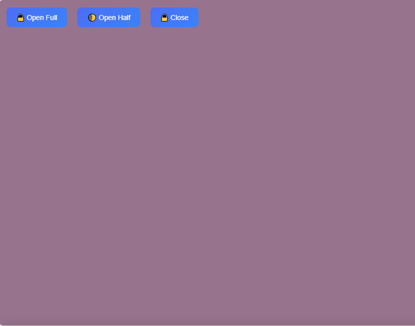

# 📱 React Bottom Sheet Assignment

This project is built as part of a company assignment. The goal was to build a custom bottom sheet in React with snap points and spring motion-style animation – without using any third-party animation libraries like react-spring-bottom-sheet.

## 🚀 Features

- Custom Bottom Sheet component using React
- Three snap points: Closed (hidden), Half-Open, and Fully Open
- Smooth animations using only requestAnimationFrame
- Users can control the sheet using drag gestures and buttons
- Icons and content added to make it visually clear
- Fully responsive for both desktop and mobile devices

## 📂 Folder Structure

react-bottom-sheet/  
├── public/  
├── src/  
│   ├── BottomSheet.js  
│   ├── BottomSheet.css  
│   └── App.js  
├── package.json  
├── README.md  
└── ...

## 🛠️ How I Ran the Project

To build and run this project locally, I followed these steps:

1. First, I created the React app using:

npx create-react-app react-bottom-sheet

2. Then I added my own component BottomSheet.js and styles.

3. I installed all required packages:

npm install

4. To run the app:

npm start

5. Open your browser and go to: http://localhost:3000  
There you can interact with the Bottom Sheet.

## 📚 What I Learned

- How to build animations without using any library (only using requestAnimationFrame)
- How to manage drag, touch events and snap logic
- How to control component position manually and via gesture
- How to create responsive UI using just CSS
- How to manage code using clean folder structure
- How to push code to GitHub and document it properly

## 🖼️ Project Preview

📌 Half Open Bottom Sheet  

🔓 Fully Open Bottom Sheet  

📱 Close Responsive View  

## 🔗 Live Demo

[Click here to view the project live](https://codesofttask.github.io/react-bottom-sheet-assignment/)

## ✅ Created By

**Manu M N**  
[GitHub Profile](https://github.com/CodesoftTask)
